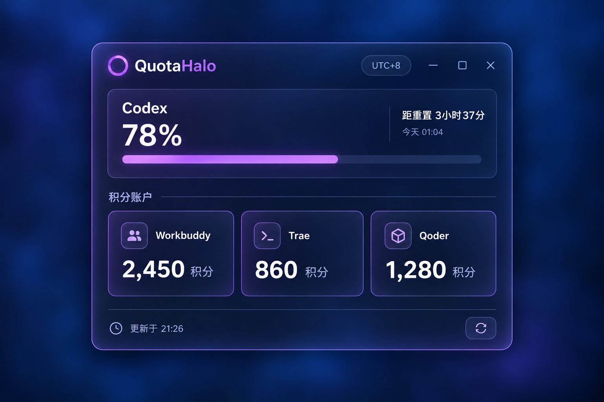

# QuotaHalo（额度光环）

QuotaHalo 是一个 Windows 托盘浮层工具，用于汇总本机 Codex 的 5 小时／每周额度，以及 WorkBuddy、TRAE、Qoder 的剩余积分。



## 功能

- 显示 Codex 5 小时和每周额度，以及倒计时和重置时间。
- 汇总 WorkBuddy、TRAE、Qoder 积分；单个服务读取失败不会影响其他服务。
- 支持完整模式和极简模式；极简模式只保留 Codex 5 小时额度。
- 支持紫晶、湛蓝、青绿、琥珀四套皮肤与 60%–100% 窗口透明度。
- 设置页提供 Qoder PAT、TRAE 网页登录或 Token 登录，以及清除已保存登录的操作。
- 托盘菜单提供显示／隐藏、刷新、打开 ChatGPT 用量页面和退出。

## 安装与运行

### 直接运行

从 `dist` 目录运行便携版 EXE：

```text
dist/QuotaHalo-<version>.exe
```

应用启动后会显示在通知区附近；点击托盘图标可显示或隐藏浮层。

### 开发模式

环境要求：Windows、Node.js、Rust 工具链、Microsoft Edge WebView2 Runtime。

```powershell
npm run dev
```

### 构建

生成便携版 EXE：

```powershell
.\scripts\build-bare-exe.ps1
```

脚本使用锁定依赖执行 release 构建，并输出 `dist/QuotaHalo-<version>.exe`。如需 NSIS 安装包：

```powershell
npm run build
```

## 服务连接

| 服务 | 连接方式 | 保存位置 |
| --- | --- | --- |
| Codex | 使用本机已登录的 Codex CLI | 仅使用本机 CLI 会话 |
| WorkBuddy | 读取本机 WorkBuddy 共享登录态 | 不需要在 QuotaHalo 输入密码 |
| Qoder | 中国区 PAT（`pt-` 开头） | Windows 凭据管理器 |
| TRAE | 网页登录或 Cloud-IDE-Token | Windows 凭据管理器 |

进入完整模式底栏的齿轮即可打开设置页。Qoder 和 TRAE 凭据重启后会自动恢复；可在相应服务卡片选择“忘记此登录”删除。

不要把 PAT、Token、Cookie 或凭据管理器内容发送给他人或提交进 Git。

## 数据与刷新

- Codex：启动时读取一次，随后每 3 分钟刷新。
- WorkBuddy、TRAE、Qoder：每 5 分钟刷新。
- 底栏刷新按钮会同时刷新所有服务。
- 已有数据时，刷新过程继续显示上一次有效数值；超时后显示明确状态，不会推算额度。

Codex 数据经本机 `codex app-server` 读取。QuotaHalo 只解析额度百分比、窗口时长和重置时间，不保存、复制或输出认证令牌、邮箱或 App Server 原始响应。

## 验证

```powershell
& .\scripts\test-frontend-bootstrap.ps1
node .\scripts\test-refresh-lifecycle.mjs
cargo test --manifest-path src-tauri\Cargo.toml
```

其中需要真实 Codex CLI 或 WorkBuddy 登录态的集成测试默认忽略，需手动运行。

## 已知限制

- 需要本机安装并登录 Codex CLI；应用优先查找 `%LOCALAPPDATA%/OpenAI/Codex/bin/*/codex.exe`，找不到时使用 `PATH` 中的 `codex`。
- Qoder 与 TRAE 使用客户端／网站内部接口，服务端更新可能导致解析需要调整。
- 多显示器、不同 DPI 缩放和不同任务栏位置下，浮层与通知区的距离可能略有差异。
