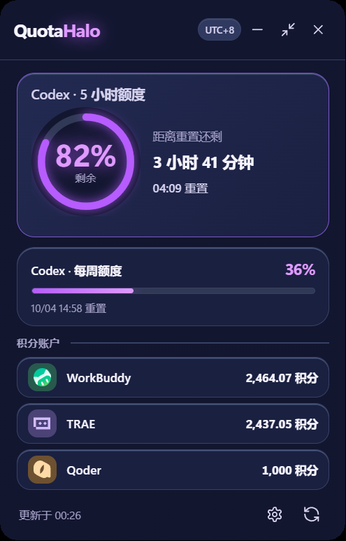

# QuotaHalo

**在 Windows 桌面集中查看 Codex 额度与常用 AI 开发工具积分**

[下载最新版](https://github.com/somebodyvipvip-a11y/QuotaHalo/releases/latest) · [报告问题](https://github.com/somebodyvipvip-a11y/QuotaHalo/issues) · [参与贡献](#参与贡献)

QuotaHalo（额度光环）是一款轻量的 Windows 托盘浮层应用。它在一个窗口中展示 Codex 的 5 小时和每周额度，并汇总 WorkBuddy、TRAE、Qoder 的积分状态。应用支持完整模式、极简模式和贴边收起，适合常驻桌面使用。

  

真实 Windows 运行截图；其中的额度和积分只用于展示界面。

## 功能亮点

| 功能 | 说明 |
| --- | --- |
| Codex 额度 | 展示 5 小时和每周窗口的剩余比例、重置时间及实时倒计时。 |
| 多服务积分 | 独立读取 WorkBuddy、TRAE、Qoder；单个服务异常不会影响其他服务。 |
| 智能显示 | 未登录账户默认隐藏，可分别控制三个积分账户是否显示。 |
| 完整与极简模式 | 完整窗口支持调整大小；极简模式固定为紧凑浮层，只保留 Codex 5 小时额度。 |
| 边缘窥视 | 完整或极简窗口靠近屏幕左侧、右侧或顶部时自动收起；悬停后按进入前的模式展开。 |
| 外观定制 | 提供紫晶、湛蓝、青绿、琥珀四套主题，以及 60%–100% 的窗口透明度。 |
| Windows 托盘 | 单击原地显示／隐藏；双击切换或聚焦完整模式；右键可直接选择三种显示模式。 |
| 本机凭据保护 | Qoder 和 TRAE 凭据保存在 Windows 凭据管理器，可随时从设置页移除。 |

## 快速开始

### 1. 下载

前往 [GitHub Releases](https://github.com/somebodyvipvip-a11y/QuotaHalo/releases/latest)，下载：

~~~text
QuotaHalo-<版本号>.exe
~~~

这是便携版程序，无需安装。建议将 EXE 放入固定目录后再运行。

> 当前发布文件没有代码签名。Windows 首次运行时可能显示未知发布者提示，请确认文件来自本仓库的 Releases 页面。

### 2. 运行

双击 EXE 后，QuotaHalo 会显示在桌面和 Windows 通知区：

- 单击托盘图标可在当前位置显示或隐藏窗口。
- 双击托盘图标时，边缘或极简窗口会原地切换为完整模式；完整窗口会显示并获得焦点。
- 右键托盘图标可选择完整、极简或边缘模式，也可刷新额度、打开用量页面或退出。
- 点击窗口右上角关闭按钮会收起到托盘，不会退出程序。
- 如需完全退出，请使用托盘菜单中的“退出”。
- 底栏刷新按钮可立即更新全部额度和积分。

### 系统要求

- Windows
- Microsoft Edge WebView2 Runtime
- 已安装并登录的 Codex CLI（仅在需要读取 Codex 额度时）

QuotaHalo 会优先查找：

~~~text
%LOCALAPPDATA%\OpenAI\Codex\bin\*\codex.exe
~~~

如果该位置不存在，则尝试使用 <code>PATH</code> 中的 <code>codex</code>。

## 使用方式

### 完整模式

完整模式展示 Codex 两个额度窗口和已启用的积分账户。窗口支持调整宽度和高度；账户显示变化时，应用会同步调整内容区域。

百分比表示**剩余额度**，不是已使用额度。已有数据的刷新过程中会保留上一次有效结果；请求失败或超时时会显示明确状态，不会把未知额度显示为 0。

### 极简模式

点击标题栏的极简模式按钮，可切换为固定大小的紧凑浮层。极简模式只展示 Codex 5 小时额度、重置倒计时和恢复按钮。

应用每次启动时默认进入完整模式，不会在启动时直接恢复到极简或贴边状态。

### 边缘窥视

边缘窥视在完整模式和极简模式中均可使用：

- 将窗口靠近屏幕左侧或右侧，会收起为窄竖条。
- 将窗口靠近屏幕顶部，会收起为窄横条。
- 屏幕底部不会触发吸附。
- 悬停边缘条会恢复进入前的模式；完整模式会保留用户调整后的窗口尺寸，极简模式恢复固定尺寸。
- 移开鼠标后窗口会延迟收起。
- 按住边缘条拖动时，窗口会先展开，再跟随拖动并重新判断吸附位置。
- 双击托盘图标会退出边缘状态并在当前边缘原地展示完整模式。
- 从托盘菜单选择“边缘模式”时，窗口会自动吸附到当前显示器最近的左、右或上边缘。
- 从托盘菜单选择完整或极简模式时，窗口沿当前边缘向屏幕内展开；普通模式间切换会保留当前位置并自动校正越界。
- 软件启动时默认放在屏幕右下角，但该程序性定位不会立即触发边缘窥视。

进度条沿用当前主题颜色，并直接显示 Codex 5 小时额度，不会额外发起网络请求。

### 积分账户显示

设置页提供以下显示选项：

- 显示或隐藏未登录账户；默认隐藏。
- 分别显示或隐藏 WorkBuddy、TRAE、Qoder。
- 设置保存在本机，修改后立即生效。

临时网络错误不会被当成“未登录”，以免隐藏有用的错误状态。

## 服务连接

点击底栏齿轮打开设置页。

| 服务 | 连接方式 | 本地处理方式 |
| --- | --- | --- |
| Codex | 使用本机已登录的 Codex CLI | 通过本机 <code>codex app-server</code> 读取额度，不额外要求输入凭据。 |
| WorkBuddy | 使用本机 WorkBuddy 登录态 | 读取 WorkBuddy 桌面端共享会话，无需在 QuotaHalo 中输入密码。 |
| Qoder | 中国区 <code>pt-</code> 开头的个人访问令牌（PAT） | 在设置页连接，凭据保存到 Windows 凭据管理器。 |
| TRAE | 网页登录或 Cloud-IDE-Token | Token 和读取到的会话凭据保存到 Windows 凭据管理器。 |

Qoder 和 TRAE 可在对应设置卡片中选择“忘记此登录”。TRAE 的网页登录窗口还可能在 WebView2 用户数据中保留网站会话。

WorkBuddy、TRAE 和 Qoder 使用各自服务提供的接口。服务端接口发生变化时，可能需要更新 QuotaHalo 的适配逻辑。

## 刷新策略

| 数据 | 自动刷新 |
| --- | --- |
| Codex 额度 | 启动时立即读取，之后约每 3 分钟刷新。 |
| WorkBuddy、TRAE、Qoder | 启动后读取，之后约每 5 分钟刷新。 |
| 手动刷新 | 点击底栏刷新按钮，同时更新全部服务。 |

不同服务独立返回结果。某个服务超时、未登录或读取失败，不会阻塞其他服务。

## 隐私与安全

- Codex 数据只解析额度百分比、窗口时长和重置时间，不保存或输出认证令牌、邮箱及 App Server 原始响应。
- Qoder PAT、TRAE Token 和读取到的会话凭据使用 Windows 凭据管理器保存。
- WorkBuddy 使用本机已有的共享登录态。
- 凭据输入框在连接操作后会被清空。
- 请勿在 Issue、日志或截图中提交 PAT、Token、Cookie、邮箱或其他个人信息。

本项目与 OpenAI、WorkBuddy、TRAE、Qoder 没有官方关联。相关名称和商标归各自权利人所有。

## 从源码运行

### 开发环境

需要准备：

- Windows
- Node.js
- Rust 工具链
- Microsoft Edge WebView2 Runtime

安装锁定依赖并启动开发模式：

~~~powershell
npm ci
npm run dev
~~~

### 构建便携版

~~~powershell
.\scripts\build-bare-exe.ps1
~~~

脚本使用 <code>Cargo.lock</code> 执行 release 构建，并生成：

~~~text
dist/QuotaHalo-<版本号>.exe
~~~

构建 NSIS 安装包：

~~~powershell
npm run build
~~~

<code>dist/</code>、<code>node_modules/</code> 和 Rust 构建目录不会提交到源码仓库。预编译版本以 Releases 页面为准，仓库源码可能包含尚未发布的新改动。

## 测试

~~~powershell
& .\scripts\test-frontend-bootstrap.ps1
node .\scripts\test-refresh-lifecycle.mjs
cargo test --locked --manifest-path src-tauri\Cargo.toml
~~~

依赖真实 Codex CLI、WorkBuddy 登录态或网络连接的集成测试默认忽略，需要在相应本机环境中手动运行。

## 项目结构

~~~text
src/                         WebView 界面、样式和前端状态
src-tauri/src/               Tauri 原生窗口、托盘、额度与积分适配
src-tauri/tauri.conf.json    窗口和打包配置
scripts/                     构建、诊断和回归测试脚本
docs/                        设计说明与服务适配资料
~~~

## 常见问题

Codex 显示读取失败

确认 Codex CLI 已安装并完成登录，同时检查程序能否从默认安装目录或 <code>PATH</code> 找到 <code>codex</code>。确认后点击刷新按钮重试。

WorkBuddy 显示未登录

先启动并登录本机 WorkBuddy，再返回 QuotaHalo 刷新。QuotaHalo 不会要求输入 WorkBuddy 密码。

WorkBuddy 5.7.6 本机共享会话已观察到加密 Token。QuotaHalo 遇到该格式会显示“新版 WorkBuddy 登录态暂不兼容”，此时无法自动查询积分，重新登录不保证有效。目前自动读取仅兼容共享文件中的明文 Token。

Qoder 或 TRAE 没有积分

在设置页检查连接状态和凭据是否过期。必要时选择“忘记此登录”，然后重新连接。提交 Issue 时不要附带凭据。

窗口不见了，但托盘图标仍在

单击托盘图标即可在上次位置重新显示窗口。如果图标位于隐藏区域，请先展开 Windows 通知区。

贴边后没有自动收起

边缘窥视支持完整与极简模式，并且只支持屏幕左侧、右侧和顶部。多显示器、不同 DPI 缩放或特殊任务栏布局可能影响边缘判断。

## 参与贡献

欢迎提交 Issue 和 Pull Request。提交问题时，请尽量提供：

- Windows 版本和显示缩放比例
- QuotaHalo 版本
- 清晰的复现步骤
- 预期结果与实际结果
- 已清理个人信息的截图或日志

提交代码前，请运行项目测试并确保 <code>git diff --check</code> 通过。功能改动应保持服务之间相互隔离，单个服务失败不应影响其他额度或积分。

## 许可证

QuotaHalo 使用 [GNU Affero General Public License v3.0](LICENSE) 开源。
